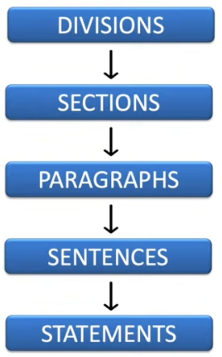

# COBOL Basic Syntax
## Notes

`COBOL` is a column dependant language. This means that it looks at a line of
code and it expects certain things to be at certain positions in that line. 
Specifically, it looks at five key areas of a 72-character line. 
You can find the `COBOL` documentation [here](https://www.ibm.com/docs/en/cobol-zos)

### Some General Info

Columns numbering 1 to 6 are the **Sequence Number Area**. They are either blank or
are used to provide context to a series of statements.

Column 7 is the **Indicator Area**. It is a multipurpose area. If we are going to leave a 
comment, an * (asterisk / star) goes in here or if we continue a previus line, it wil be 
a dash or a hyphen. It can also be a `D` for a debugging line or a `/` for *source code listing formatting*.
It is only one character.

From columns 8 to 11, in **A Area**, we will find devisions, sections, paragraphs, level indicators and other elements
that give `COBOL` programs their *structure*.

**B Area**, spanning from column 12 to 72, contains the actual statements, sentences and clauses, the things that make a 
`COBOL` program do its stuff.

The **Identification Area** is not considered by the compiler so the programmer can use it however he/she/they want. It is often
left blank.

As every programming language out there, `COBOL` has its own reserved words, like `READY`, `END`, `SET`, `DATA`, `UNTIL`, `FILE`, and `IF`
and when the compiler sees those words, it will do something very specific, so they must not be used outside of their purpose. You can find a list
of these reserved words [here](https://www.ibm.com/docs/en/cobol-zos/6.3?topic=appendixes-reserved-words)

### Program Structure
`COBOL` has a [**hierarchy** structure](https://dev.to/manomite/what-is-hierarchy-in-programming-5f7o), meaning it has things in other things.

1. **Statements**: A statement is a single directive, usually starting with a reserved word. 
2. **Sentences**: They contain one or more *statements*. The scope of **Sentences** is ended by a periond (.) or an [explicit scope terminator](https://www.ibm.com/docs/en/cobol-zos/6.3?topic=division-scope-terminators)
3. **Paragraphs**: Basically, they are containers of *sentences*. User defined code that will give the program structure. They can have specific names, so they can be called.
4. **Sections**: They are *paragraph* containers. They can have user defined of predefined names to give the program structure, or store information.
5. **Divisions**: `COBOL` has four different kinds of devisions:
⋅⋅* **Identification Division**: This is where information about the program goes, like the name, the writer's name, how it should be used, etc.
⋅⋅* **Environment Division**: There are two major sections here. The one that the programmer sets, which contains the computer environment requred to run
the program and the other sets the mapping between the files and the program and the files on the actual data sets. Basically, it is the link between the program and the system it is running on.
⋅⋅* **Data Division**: It sets all of the data that will be used through the program. It includes files, data from other programs, what type of storage or memory you  will use while the program is running and what it will give up when the program ends. 
⋅⋅* **Procedure Division** This is where all those sections and paragraphs go. 

