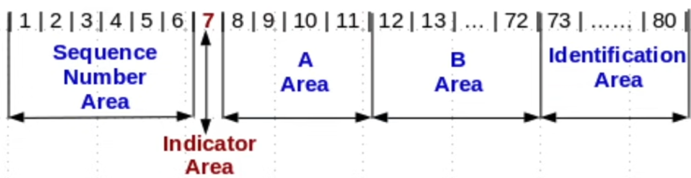

# COBOL Basic Syntax
## Notes

`COBOL` is a column dependant language. This means that it looks at a line of
code and it expects certain things to be at certain positions in that line. 
Specifically, it looks at five key areas of a 72-character line. 

Lines numbering 1 to 6 are the *Sequence Number Area*